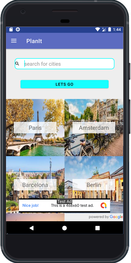
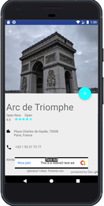

# **PlanIt**
This is my final application for Udacity's Android Nanodegree

## Description
A handy travel application that would help you organize and plan your trip itinerary. 
It gives you the opportunity to create different bucket lists for each place you’re planning to visit and add all 
you want to do in one specific place. Not only does it help you plan your trip but it also gives you insights about the top things 
to do in each city. It also quickly helps you figure out what are the best landmarks near you.

## Features
- Browse most popular destinations
- Browse the top things to do in each city
- Details about landmarks and activities
- Create bucket lists for each city planned to visit
- Add your favorite places to your calendar

### What I Use
- Androidx
- Widgets
- Retrofit
- Picasso
- Leinardi speeddial 
- Material Calendar
- Navigation Component
- Android Room Persistence & Livedata
- Espresso UI Testing
- Google AdMob
- Google Analytics
- Google Crashalytics

### User Interface

   
    

### License
<blockquote Copyright 2019 Yahia Salem

Licensed under the Apache License, Version 2.0 (the "License");
you may not use this file except in compliance with the License.
You may obtain a copy of the License at

    http://www.apache.org/licenses/LICENSE-2.0

Unless required by applicable law or agreed to in writing, software
distributed under the License is distributed on an "AS IS" BASIS,
WITHOUT WARRANTIES OR CONDITIONS OF ANY KIND, either express or implied.
See the License for the specific language governing permissions and
limitations under the License.
© 2019 GitHub, Inc.
</blockquote>
